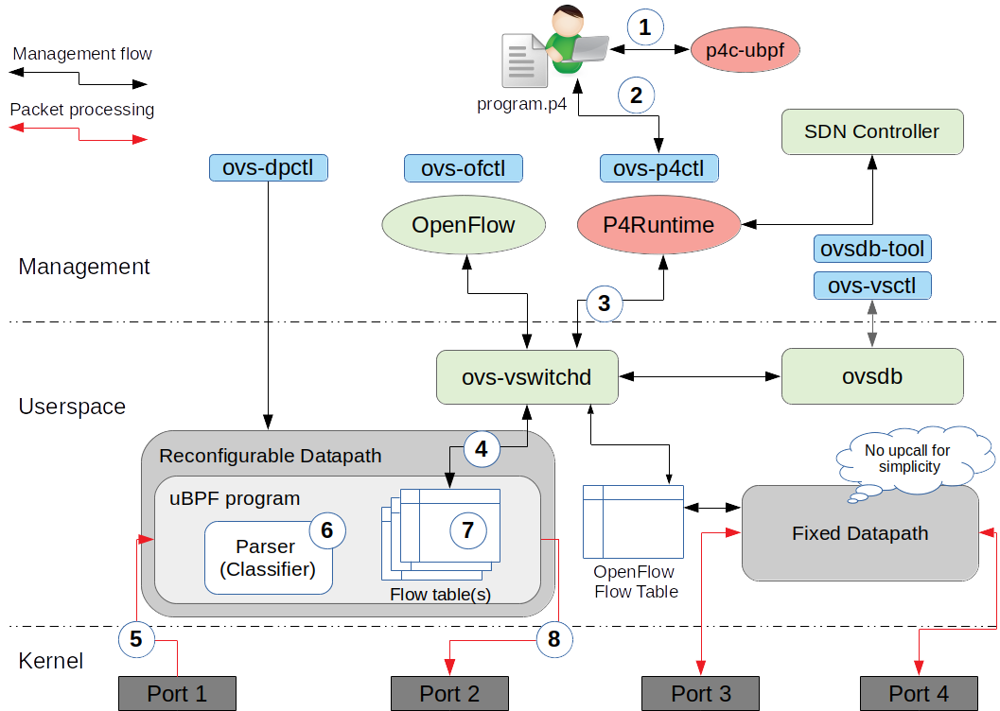

# Design document

OvS.p4 is a new of Open vSwitch that supports user-configurable, protocol-independent (P4) datapath.

Open vSwitch is a high-performance programmable virtual switch, which was created over 10 years ago as the OpenFlow switch. Through these years it achieved maturity and production readiness.

OvS.p4 is heavily based on Open vSwitch. I have decided to leverage Open vSwitch as a foundation for a new P4 software switch due to the following reasons:

* Open vSwitch has already mature support for fast kernel by-pass solutions such as DPDK or AF_XDP. Therefore, this portion of code can be re-used.
* Open vSwitch implements lightweight and mature database called OVSDB. Again, OVSDB can be re-used to store & sync a state of P4 software switch.
* The usage model verified by the community.

The open question is whether OvS.p4 should become a part of the Open vSwitch project or evolve into a new open-source project. Until this decision will be made, OvS.p4 is considered to be a hybrid (OpenFlow + P4Runtime) solution, what affects design choices described in this document.

## Prerequisites

* If you are not familiar with the design and implementation of Open vSwitch it is highly recommended to read [the OVS documentation](http://docs.openvswitch.org/en/latest/).

## Design assumptions

* **Backward compatibility and seamless integration with OpenFlow** - users should be still able to use well-known, existing features of Open vSwitch. P4 support should be rather an option.
* **P4 program per bridge** - Open vSwitch allows to run multiple OVS bridges created by the same OVS instance. The OvS.p4 introduces a new bridge type, called "P4 bridge". Each P4 bridge has its own P4 program that describes the data plane features of the bridge.
* **Keep modularity of Open vSwitch** - the architecture of Open vSwitch is modular and allows to integrate new OpenFlow datapaths easily. The design and implementation of OvS.p4 should also follow the modular approach.
* **Support for Portable Switch Architecture (PSA)** - OvS.p4 is not going to propose yet another P4 architecture model. On the contrary, I want to leverage already existing and well-documented `PSA architecture <https://p4.org/p4-spec/docs/PSA.html>`_.
* **P4Runtime as control interface** - OpenFlow is not extensible and is not able to support P4. I do not believe that the translation between P4 and OpenFlow is possible. Therefore, OvS.p4 (P4 bridges exactly) will expose P4Runtime-based control interface to external applications (controllers).

## Architecture

From the functional point of view OvS.p4 extends a base Open vSwitch with four new blocks:

* **Reconfigurable (or P4) datapath** - the new, big component is responsible for handling incoming packets to ports associated with P4 bridge. It should allow to inject a new packet processing pipeline (generated from the P4 program) at runtime. The reconfigurable datapath exposes interface to manage P4 programs and control P4 objects (e.g. P4 tables, registers, etc.). The example of reconfigurable datapath can be eBPF, XDP or uBPF.
* **P4Runtime interface** - this functional block provides an abstraction layer between reconfigurable datapath and external controllers. In particular, it implements gRPC server (with P4Runtime proto) and allows users to control P4 datapath.
* **P4 compiler** - even though the P4 compiler is going to be implemented in a separate repository it is also a part of functional architecture. Users leverages the P4 compiler to generate datapath-specific binary from the P4 program and P4Info metadata file for P4Runtime interface.
* **ovs-p4ctl** - the management utility for the P4 bridge. It manages P4 programs and controls P4 objects. The other management tasks (e.g. adding new port) are still implemented by other OVS utility tools (e.g. ovs-vsctl).

### Reconfigurable datapath

So far, the two following datapaths are taken into considerations:

* **userspace Berkeley Packet Filter (uBPF)** - 
* **eXpress DataPath (XDP)** - 

## Use cases

Where do I see the application for a high-performance P4 software switch?

* **Extensible, customizable hypervisor switch** -
* **Low cost, programmable "bare metal" switch on commodity server** - 
* **Data plane of VNFs** -
* **Hybrid OpenFlow + P4Runtime deployments** - some open-source SDN controllers (e.g. ONOS) support both OpenFlow and P4Runtime.
The OvS.p4 could be used in such a hybrid deployments.

## Implementation

In this section I list the implementation-specific aspects. 

### Impact on original OVS code

The following modifications have been applied to original OVS code to enable P4 datapath:

* `dpif-netdev.c / create_dp_netdev()` - the memory allocation has been moved outside the `create_dp_netdev()` function,
to allow `dpif-ubpf` to re-use a part of `dpif-netdev`. 

* The `dpif-provider` is shared between OpenFlow datapath interface and P4Runtime datapath interface. The `struct dpif_class`
has been extended with functions dedicated only for P4 (reconfigurable) datapath. These functions should not be implemented by OpenFlow datapath interface.

